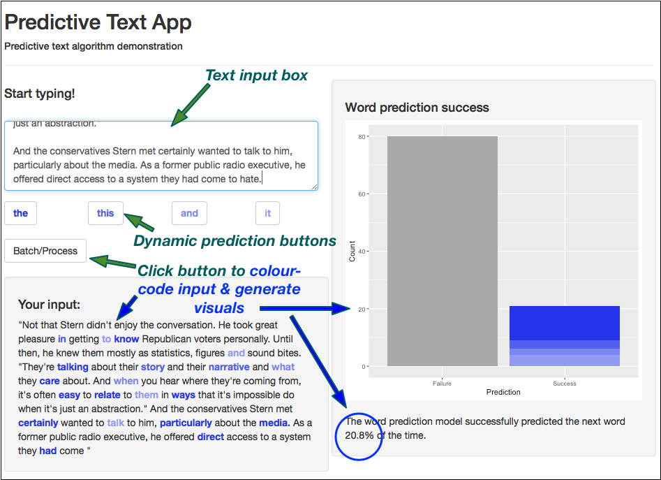

Predictive Text with Markov Chain Backoff Models
========================================================
author: Mark St. John
date: Nov 29, 2018
autosize: true

The predictive text algorithm
========================================================

- Frequencies of 1--5 gram phrases were calculated, smoothed (Good-Turing Discounting) and stored in tables 
    - 5000 most frequent words appearing in 10000 sentences randonmly sampled each of News, Blogs and Twitter sources (corpus provided by SwiftKey).
- The Markov Chain "Backoff" approach:
    - Provided text -> strip n-gram from the end (up to 4 words) -> lookup in the stored n-gram frequency tables
    - Note, if the last word is **incomplete** (no trailing space or punctuation) prediction is for the **current** last word, not the **next** word
    - Search through the n-gram frequency tables (from greatest to least **n**) until matches are found
    - Return the last words of the 4 most frequent **n+1**-grams in decreasing order of frequency

Algorithm performance
========================================================
Performance was measured by creating a **test set** of 2--5 grams from 3000 sentences randomly sampled from the corpus (withheld from model training) and measuring how often the *actual* next word was predicted.

Results
---

- Correct prediction **14%** of the time
- *Actual* next word in the **top four** algorithm predictions **25%** of the time
- Average time required for a prediction was **0.2 seconds** on low-end hardware, > 5 years old

Next word algorithm in use
========================================================
The *Predictive Text App* provides a web interface to use the algorithm.

Competing approaches & conclusions
===================================

Alternative approaches considered:

- Markov Chain Backoff + Naive Bayes source prediction (News, Blogs or Twitter) 
    - Perfomance penalty, no measurable improvement in predictions
- Co-occurence model based on the *fcm()* function of the *quanteda* R package
    - Significantly lower success rates
- Rare word co-occurence weighting
    - Performance penalty yet did not produce improved results 

Conclusion
----------
Success of the Markov Chain Backoff approach lies in storing a massive amount of training data (the corpus) in compact frequency lookup tables.
